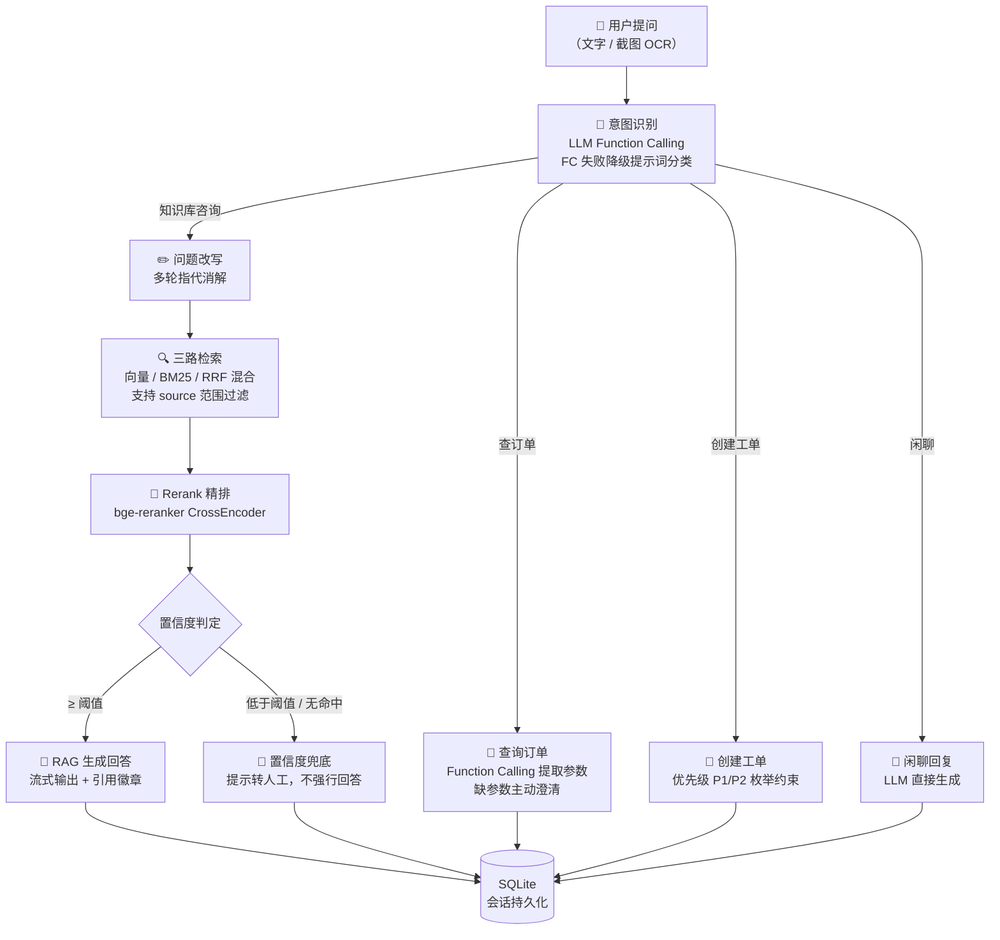
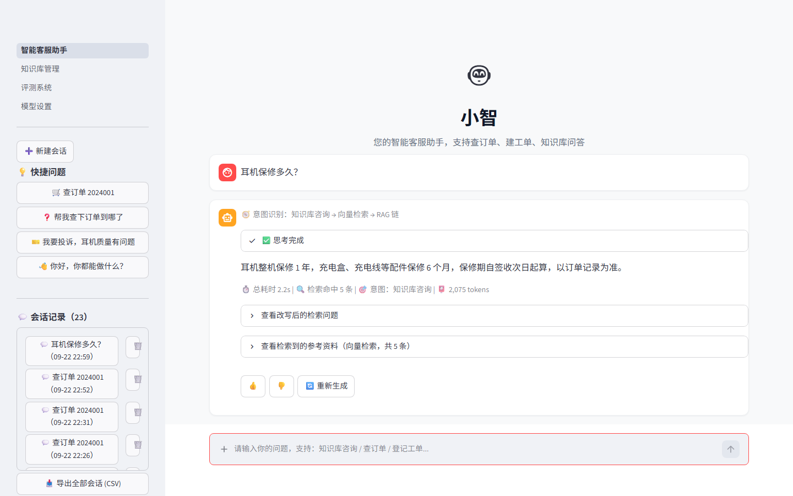
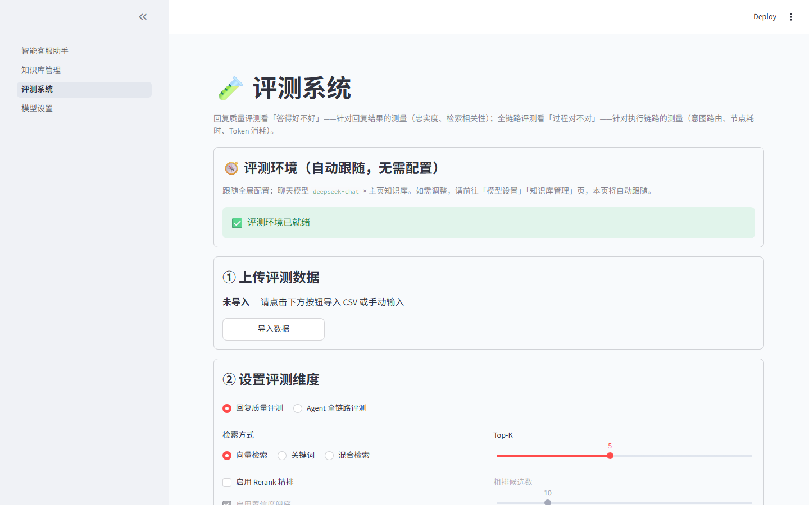

# rag-cs-agent · 智能客服 Agent「小智」

基于 RAG 与 LangGraph 的**生产级智能客服 Agent**。覆盖意图识别 → 知识检索 → 工具调用 → 回答生成的完整链路，支持本地 Ollama 与云端 API（DeepSeek / DashScope / SiliconFlow / 自定义 OpenAI 兼容地址）双模型切换、向量空间兼容检测与一键重建，内置双模块评测系统（回复质量 / Agent 全链路节点诊断）与「金标校准 → 全量机评 → 人工盲评」三层评测校准闭环，支持 LangSmith 跨实验对比。

> 📊 [架构总览（Mermaid）](#架构概览)

## 架构概览



> 检索层三路互补：向量检索擅长语义匹配（Chroma + 嵌入模型）、BM25 擅长关键词精确匹配（jieba 分词）、RRF 倒根据数排名融合两者；Rerank 用 CrossEncoder 逐对精排后在候选中选出 top_k，置信度低于阈值时兜底不强行回答。

## 技术栈

| 层级 | 技术选型 | 说明 |
|------|---------|------|
| Agent 编排 | LangGraph 1.2 | StateGraph 6 节点意图路由，流式输出（messages + values） |
| LLM | Ollama / OpenAI 兼容 API | 本地 qwen2.5:1.5b 或 DeepSeek/DashScope/SiliconFlow，工厂层统一 |
| 向量嵌入 | Ollama / OpenAI 兼容 API | 本地 bge-m3 或 text-embedding-v4，空间一致性自动检测 |
| 向量数据库 | ChromaDB | 轻量级本地向量库 |
| 关键词检索 | rank-bm25 + jieba | BM25Okapi + 中文分词 |
| Rerank 精排 | sentence-transformers | bge-reranker CrossEncoder，CPU 推理 |
| 文档加载 | Docling + RapidOCR | 文档解析走 Docling（PDF/图片启用内置 OCR，中英文）；聊天截图识别走 RapidOCR（onnxruntime CPU 本地推理） |
| 文本切分 | 自定义切分器 | QA对切分/标题切分/语义切分/表格行切分 4 种策略 |
| 前端 | Streamlit 1.63 | 多页面应用，侧边栏参数配置 |
| API 后端 | FastAPI + Uvicorn | 生产集成入口，与 Streamlit 共享 core 层 |
| 配置持久化 | config.yaml + .env | 非敏感配置（含自定义 Base URL）原子写入落盘，API Key 仅会话/环境变量、绝不落盘 |
| 会话持久化 | SQLite | 手写 conversations/chat_messages 表 |

## 功能特性

### 对话页面（主页）
- 多轮对话，流式输出（LLM token 逐字显示）
- **Agent 思考轨迹可视化**：意图/改写/检索/生成逐节点耗时实时展示（`st.status` 交互组件，完成后可折叠回看），回答底部附耗时/检索命中/意图/Token 指标行
- 意图自动路由：知识库咨询 / 查订单 / 建工单 / 闲聊（Function Calling，失败降级提示词分类）
- **多模态输入**：聊天框直接粘贴/上传截图，RapidOCR 本地识别文字后自动作为提问
- **引用溯源**：回答附参考资料（来源文件 + 块号 + 相关性三档色徽章）
- **重新生成**：对最后一条回答一键重跑（会话与数据库同步清理旧回答）
- 会话历史持久化（SQLite），支持折叠、切换/删除会话
- 侧边栏参数实时调整：检索方式（向量/关键词/混合）、TOP_K、相似度阈值、Rerank 开关与阈值、置信度兜底（与 Rerank/检索方式自动联动置灰）
- 知识库文档**上传确认后自动参与检索**，无需手动勾选范围
- **模型设置**：本地 Ollama / 云端 API 双来源切换，API 模式支持自定义接口地址（Base URL，适配中转/代理服务），支持测试连接与保存生效；嵌入模型变更时提示一键重建知识库
- **多用户安全**：API Key 仅存于各自会话、不落盘不串号；上传内容一律 HTML 转义展示防 XSS

### 知识库管理页面
- 上传文档 → 切分预览 → 确认后向量化入库（未确认不写库）
- 4 种切分策略可切换，参数联动：
  - **QA对切分**（默认）：按【问题】标记切分，一个「问题+答案」= 一个块，超长块二次切分
  - **标题切分**：按 `#/##/###` 分节，超长节递归二次切分，适合 FAQ/技术文档
  - **语义切分**：按句子相似度在语义转折处切分，嵌入不可用时降级为递归字符切分
  - **表格行切分**：xlsx/xls/csv 按行切分，每行 = 一个知识块
- 已入库文档管理：查看切块详情、删除（二次确认）
- **向量空间守卫**：当前嵌入模型与知识库建库空间不一致时，自动阻断入库，引导去主页一键重建
- **重建安全**：重建前先对嵌入服务做可用性预检，失败立即中止、旧库数据完好；旧版 `.ppt` 明确拒绝（引导另存 `.pptx`），失败不产生占位脏数据

### 评测系统页面（跟随全局配置，三步开跑）

- **评测环境跟随主页**：直接使用「模型设置」页的当前模型与正式知识库，无需在评测页重复配置；环境异常时明确阻断
- **💬 回复质量评测**：
  - 完整评测：批量运行检索→生成→LLM 评分（检索相关性/答案忠实度/答案相关性/语义相似度），导出 CSV 报告
  - 三模式检索对比：同批问题分别用向量/关键词/混合检索，对比命中率与耗时（秒级出结果）
- **🔬 Agent 全链路评测**：直接运行生产 LangGraph，逐节点采集输出/耗时/**Token 消耗**，LLM 裁判逐节点评分、错误自动归因到具体节点；裁判调用失败显式标记 `judge_failed`（绝不静默当满分）；支持 ☁️ 上报 LangSmith 实验看板做跨实验对比
- **三层评测校准闭环**：① 金标题集校准裁判（机评 vs 人工标注一致率达标才放行）→ ② 多组参数全量机评对照 → ③ A/B 乱序人工盲评揭盲，验证裁判方向与人工同向率，保证评测结论可信

> 注：早期版本的「运营报表」页（线上会话 KPI / 意图分布 / Bad Case 清单）已移至 `pages_disabled/` 隐藏，代码保留，需要时移回 `pages/` 即可恢复。

## 界面预览





> 截图由 `scripts/take_screenshots.py`（Playwright）自动拍摄：先对聊天问答、知识库页、模型设置页做功能冒烟验证，全部通过后再落图。

## 项目结构

```
.
├── 智能客服助手.py          # Streamlit 主入口（UI + 图构建）
├── api.py                   # FastAPI REST 接口（对外暴露 Agent 能力）
├── pages/                   # Streamlit 多页面（与主入口同级为框架约束）
│   ├── 01_知识库管理.py      #   知识库管理（上传/切分预览/入库/删除）
│   ├── 03_评测系统.py        #   评测系统（回复质量评测 / Agent 全链路评测，跟随主页配置）
│   └── 04_模型设置.py        #   模型设置（本地/API 双来源 + 自定义 Base URL + 知识库重建）
├── pages_disabled/          # 已下线但保留代码的页面（02_运营报表.py，移回 pages/ 即恢复）
├── core/                    # 核心业务逻辑包（框架无关，Streamlit/FastAPI/脚本共用）
│   ├── agent_graph.py       #   LangGraph 图定义（意图路由/节点/边）
│   ├── retrieval.py         #   检索模块（向量/BM25/混合 + Rerank + 文档切分 + 知识库重建）
│   ├── database.py          #   SQLite 会话持久化层
│   ├── model_factory.py     #   模型工厂（本地/API 双来源统一构建 + 向量空间检查）
│   ├── chain_eval.py        #   全链路评测核心逻辑
│   ├── eval_langsmith.py    #   LangSmith 上报层（评分逻辑留本地，仅上报展示）
│   ├── tools.py             #   工具实现（订单查询/工单创建，与 @tool 解耦）
│   └── prompts.py           #   Prompt 模板集中管理
├── scripts/
│   ├── ingest_kb.py         #   批量入库脚本（CLI）
│   ├── take_screenshots.py  #   Playwright 自动截图（先功能冒烟验证后落图）
│   ├── rebuild_kb_once.py   #   知识库重建脚本（与 UI 走同一函数）
│   ├── docker_export.sh     #   离线部署包一键生成（Linux/Mac/Git Bash）
│   ├── package_source.sh    #   源码打包脚本
│   └── docker/             #   离线部署编排（docker-compose.deploy.yml + start.sh）
├── tests/                   # pytest 测试（50+ 项）
│   ├── test_graph.py        #   图路由测试
│   ├── test_retrieval.py    #   检索函数单元测试
│   ├── test_database.py     #   数据库单元测试
│   └── smoke_graph.py       #   独立冒烟脚本（可单独运行）
├── data/
│   └── source_docs/         # 原始知识文档（入库前素材）
├── docs/                    # 运行时：已入库文档副本（自动生成，已 gitignore）
├── chroma_db/               # 运行时：Chroma 向量库持久化（自动生成，已 gitignore）
├── logs/                    # 运行时：日志（app.log，5MB 轮转）
├── models/                  # 本地 Rerank 模型权重（可选，已 gitignore）
├── config.yaml              # 模型配置（来源/厂商/base_url/模型名，本地生成）
├── chat_history.db          # 运行时：SQLite 会话持久化（自动生成）
├── requirements.txt         # Python 依赖
├── pytest.ini               # pytest 配置
├── .env.example             # 环境变量示例（API Key / 访问令牌 / LangSmith）
├── .gitignore / .dockerignore
├── Dockerfile               # Docker 镜像构建
└── docker-compose.yml       # 容器编排（App + Ollama + 初始化拉模）
```

分层说明：**入口层**（智能客服助手.py / api.py）只做 UI 与依赖注入；**core/** 承载全部业务逻辑且不依赖 UI 框架（可被 Streamlit、FastAPI、脚本三方复用）；**配置层**（config.yaml + .env）非敏感配置落盘、API Key 仅走环境变量；**运行时目录**（docs/ chroma_db/ logs/ chat_history.db）由应用自动生成，已加入 .gitignore。

## 快速开始

### 1. 环境准备

```bash
# 克隆项目
git clone <repo-url>
cd <project-dir>

# 创建虚拟环境
python -m venv .venv

# Windows
.venv\Scripts\activate
# Linux/Mac
source .venv/bin/activate

# 安装依赖
pip install -r requirements.txt
```

### 2. 安装 Ollama 并拉取模型

> [!NOTE]
> 默认使用本地模型：聊天 `qwen2.5:1.5b`（约 1GB）、嵌入 `bge-m3`（约 1.2GB）。若打算全程使用云端 API 模型，此步可跳过（模型来源在「模型设置」页随时切换）。

从 [ollama.com](https://ollama.com) 安装 Ollama，然后：

```bash
# 拉取对话模型
ollama pull qwen2.5:1.5b

# 拉取嵌入模型
ollama pull bge-m3
```

### 3. 配置环境变量

```bash
cp .env.example .env
# 按实际路径编辑 .env
```

如需使用云端 API 模型，在 `.env` 中填入对应厂商的 Key（也可不填，启动后在页面「模型设置」临时输入，仅存于本次会话、不落盘）：

```bash
# DeepSeek（仅聊天）
DEEPSEEK_API_KEY=sk-xxx
# 阿里云百炼（聊天 + 嵌入）
DASHSCOPE_API_KEY=sk-xxx
# SiliconFlow（聊天 + 嵌入 BAAI/bge-m3）
SILICONFLOW_API_KEY=sk-xxx
```

> API Key 只走 `.env` 或本次会话内存，**绝不写入 config.yaml 或任何本地文件**；多用户各自的 Key 相互隔离，页面输入的 Key 关闭页面即失效。

### 4. 启动应用

```bash
streamlit run 智能客服助手.py --server.port 8501
```

浏览器访问 http://localhost:8501

### 5. 导入示例知识库（可选）

仓库自带 4 篇虚构客服 FAQ（`data/source_docs/`），批量入库后即可体验知识库问答：

```bash
# macOS / Linux / Git Bash（shell 自动展开 *.md）
python scripts/ingest_kb.py data/source_docs/*.md
```

```powershell
# Windows PowerShell（不自动展开通配符，逐个列出或用 Tab 补全）
python scripts/ingest_kb.py "data/source_docs/客服FAQ-产品使用与故障排查.md" "data/source_docs/客服FAQ-订单与物流.md"
```

> 说明：该脚本支持 `.md / .txt / .html`，向量生成走本地 Ollama `bge-m3`；PDF / Word / PPT 等格式请在「知识库管理」页上传（由 Docling 解析，能力更全）。不上传任何文档时，查订单 / 建工单 / 闲聊功能仍可正常使用，仅知识库问答无内容可检索。

### 6. Docker 部署

前置条件：安装 [Docker Desktop](https://www.docker.com/products/docker-desktop/)（Windows / Mac，2024 年后版本即可，内置 Compose v2.24+）或 Docker Engine + Compose v2.24+ 插件（Linux）。

容器镜像只包含应用本身（RapidOCR / docling 所需系统库已内置）；Ollama 大模型由 compose 的独立服务提供。

#### 模式 A：本地 Ollama 全栈（推荐，目标机零额外安装）

```bash
# 构建应用镜像 + 启动 Ollama + 首次自动拉取 qwen2.5:1.5b、bge-m3（约 2GB）
docker compose up -d --build

# 查看模型拉取进度（拉完即可访问）
docker logs -f ollama-init
```

访问 http://localhost:8501 。模型文件存放在项目 `docker_data/ollama/`（bind mount），重启不丢失。

#### 模式 B：云端 API（响应最快，需联网 + API Key）

```bash
# 1. 在 .env 中填写云端 Key（参考 .env.example），如 SILICONFLOW_API_KEY / DEEPSEEK_API_KEY
# 2. 只启动应用容器（不启动 Ollama；需 Docker Compose v2.24+）
docker compose -f docker-compose.yml -f docker-compose.cloud.yml up -d --build
```

启动后在页面「🧠 模型设置」中将聊天/嵌入模型切换为云端 API 并保存生效。

#### 模式 C：离线部署到其他电脑（内网隔离环境）

在**有网络**的本机一键生成自包含部署包：

```bash
# Linux / Mac / Windows Git Bash
bash scripts/docker_export.sh
```

脚本自动完成：构建应用镜像 → 拉取 Ollama 镜像与本地模型（`qwen2.5:1.5b` 聊天 + `bge-m3` 嵌入）→ 导出镜像 tar → 归集知识库（`chroma_db/`）、Rerank 权重（`models/`）、Ollama 模型、会话库、文档与配置，产物为 `docker_deploy/`（约 3~4GB）。

目标电脑（无需 Python、无需 Ollama，只需 Docker）：

1. 拷贝整个 `docker_deploy/` 目录（U 盘需 exFAT/NTFS 格式）
2. 进入目录执行 `bash start.sh`（Linux/macOS 直接运行；Windows 用 Git Bash；脚本自动加载离线镜像并启动）
3. 浏览器访问 http://localhost:8501

> [!WARNING]
> 离线部署包会包含运行时生成的 `.env`（API Key / 访问令牌）、`config.yaml`（模型配置，不含 Key）与会话库，属本地敏感数据，仅限受控环境拷贝，切勿上传公开位置。

#### 数据持久化与常用命令

| 容器路径 | 宿主机目录 | 内容 |
| --- | --- | --- |
| `/app/chroma_db` | `./chroma_db` | Chroma 向量知识库 |
| `/app/models` | `./models` | 本地 Rerank 权重 |
| `/app/docs` | `./docs` | 已入库文档原件 |
| `/app/persistent/config.yaml` | `./config.yaml` | 模型配置 |
| `/app/persistent/chat_history.db` | `./chat_history.db` | 会话库 |
| `/root/.ollama` | `./docker_data/ollama` | Ollama 模型（仅 local 模式） |

```bash
docker compose ps                     # 查看服务状态
docker logs -f smart-cs-bot           # 跟踪应用日志
docker compose down                   # 停止（云端模式见模式 B 的 -f 参数）
```

### 7. REST API（可选）

```bash
# 启动 FastAPI 服务
python api.py
# 或
uvicorn api:app --host 0.0.0.0 --port 8000
```

API 文档（Swagger）：http://localhost:8000/docs

```bash
# 示例：调用问答接口（需在 .env 配置 API_ACCESS_TOKEN，并在请求头 X-API-Key 携带）
curl -X POST http://localhost:8000/api/chat \
  -H "Content-Type: application/json" \
  -H "X-API-Key: <你的访问令牌>" \
  -d '{"question": "退货政策是什么？", "retrieval_mode": "向量检索"}'
```

## 模型配置（本地 / 云端 API）

通过 `core/model_factory.py` 统一管理模型来源，Streamlit 与 FastAPI 共用同一份 `config.yaml`。

### 双来源切换

在「🧠 模型设置」页中：
- **聊天模型**：本地 `qwen2.5:1.5b` / API（DeepSeek / DashScope / SiliconFlow / 自定义）
- **嵌入模型**：本地 `bge-m3` / API（DashScope text-embedding-v4 / SiliconFlow BAAI/bge-m3 / 自定义）
- **本地模型列表按能力自动过滤**：聊天下拉框只列出有对话能力的模型，嵌入下拉框只列出有 embedding 能力的模型（按 Ollama `/api/show` 的 `capabilities` 判断，失败时降级按模型名关键词过滤），避免聊天模型误入嵌入列表
- **自定义接口地址（Base URL）**：API 模式下可直接填写 OpenAI 兼容的中转/代理地址，留空则用厂商官方地址
- 支持「测试连接」（返回模型回复或向量维度）与「保存并生效」（版本号 +1 触发运行时缓存重建，无需重启）；配置写入采用临时文件 + 原子替换，断电不损坏
- **云端不可用自动回退本地**：API 配置失效时回退本地 Ollama，并清空模型名避免"用云端模型名请求本地"的必失败组合

### 向量空间兼容与重建

> [!WARNING]
> 嵌入模型决定向量空间，更换为不同空间的模型后**必须重建知识库**，否则新旧向量混检会导致检索错乱（且是用户无感知的静默错误）。系统提供两层防护：

1. **阻断式守卫**：空间不一致时，知识库页禁止入库、评测页禁止评测，明确提示去重建。
2. **一键重建**：「模型设置」提供「🔄 重建知识库」按钮，先做嵌入服务预检（失败即中止、旧数据完好）→ 清空旧向量 → 遍历 `docs/` 目录全部已入库文档重切分重嵌入 → 写回空间标识 → 递增版本号触发 BM25 索引跨进程即时重建。

### 配置持久化规则

| 内容 | 存储位置 | 是否落盘 |
|------|---------|---------|
| 模型来源 / 厂商 / Base URL / 模型名 | `config.yaml` | ✅ |
| API Key | `.env` 或会话内存 | ❌（页面输入仅本次会话有效，关闭即失效） |
| 知识库当前向量空间 | `config.yaml` | ✅（重建后自动更新） |

## 知识库说明

项目内置 4 篇客服 FAQ Markdown（订单物流/产品故障/账户支付/退换售后），覆盖客服常见场景。入库流程：上传 → 切分预览 → 确认后向量化。

## 关键设计决策

1. **为什么用 LangGraph 而非简单 Chain？** — 多意图路由需要条件分支，图结构天然支持；且可在节点间传递状态（检索结果、轨迹、置信度），便于实现兜底逻辑。

2. **为什么三路检索？** — 向量检索擅长语义匹配，BM25 擅长关键词精确匹配，RRF 融合两者互补；用户可按场景切换。

3. **为什么两阶段检索（召回→Rerank）？** — 向量检索快但粗，Rerank 用 CrossEncoder 逐对精排，在召回候选中选出最相关的 top_k，精度更高。

4. **为什么图节点不直接读页面状态？** — LangGraph 执行节点时跑在后台线程，拿不到 Streamlit 页面的状态变量；所以启动图前先把需要的数据打包传入，节点之间通过图内部通道传递数据，不碰页面状态。

5. **为什么知识库切分要预览？** — 切分质量直接决定检索效果；预览→确认的闭环避免错误切分写入向量库后难以排查。

6. **为什么抽模型工厂层？** — 模型来源有三个消费方（Streamlit 主对话 / 评测系统 / FastAPI 后端），工厂层集中构建模型实例，三入口读同一份 `config.yaml` 保证行为一致；API 配置无效时自动回退本地模型并返回 warning，保证系统可用。

7. **为什么 API Key 不落盘？** — Key 是敏感信息，落盘即有泄露风险（多用户共用部署时还会互相串用、互相计费）；非敏感配置（来源/厂商/base_url/模型名）存 `config.yaml`，Key 仅走 `.env` 或各自会话内存，页面输入的 Key 绝不写盘、关闭页面即失效。

8. **为什么嵌入模型切换要阻断而非自动重建？** — 新旧向量混检是静默错误（用户只觉得答非所问），自动重建在用户无感知时改全库，出问题无法归因；宁可明确阻断并引导一键重建，也不产出脏数据。

9. **为什么评测评分逻辑留本地？** — LangSmith 只负责存储/展示/对比，评分（相关性/忠实度/语义相似度/归因）完全在本地计算，避免依赖外部服务且保证评测口径可控。

10. **为什么双入口（Streamlit + FastAPI）？** — Streamlit 适合运营侧（对话/传文档/看评测报表），FastAPI 适合生产集成；双入口共享 core 层，业务逻辑只写一遍，代价是两边运行时资源管理各写一份。

## 运行测试

```bash
# pytest（50+ 项测试：图路由 + 检索函数 + 数据库）
pytest tests/ -v

# 或运行独立冒烟脚本
python tests/smoke_graph.py
```

测试覆盖：
- **test_graph.py**：意图路由 + RAG 生成/无命中兜底/置信度兜底 + source 过滤透传 + 流式事件
- **test_retrieval.py**：format_docs、doc_key、文件哈希、路径安全、BM25 分词、4 种切分策略、空集合过滤
- **test_database.py**：会话 CRUD、消息保存/加载、级联删除、文档序列化、历史截断

## 🎯 项目亮点

### 项目概述

> 这是一个生产级智能客服 Agent：LangGraph 做**多意图路由**（知识库 / 查订单 / 建工单 / 闲聊），检索层用「向量 + BM25 + RRF 混合召回 → bge-reranker 精排 → 置信度兜底」保证回答质量，**宁可提示转人工也不强行编造**；模型层通过工厂抽象支持本地 Ollama 与云端 API（含自定义中转地址）一键切换，并做了**向量空间守卫**防止换模型后的静默检索错误；评测侧覆盖回复质量与**全链路节点诊断**（路由/改写/检索/工具/回复逐节点耗时与 Token 采集），并通过「金标校准 → 全量机评 → 人工盲评」三层校准证明 LLM 裁判可信，可一键上报 LangSmith 做跨实验对比。整个 core 层框架无关，Streamlit 与 FastAPI 双入口复用同一套业务逻辑。

### 功能示例

**示例 1 · 查订单 —— Function Calling 与参数澄清**

| 步骤 | 操作 | 效果 |
|------|------|------|
| 1 | 输入 `帮我查一下订单 2024001` | 思考轨迹显示路由到查订单节点，FC 提取 `{"order_id": "2024001"}` 并在 route_note 中透明展示 |
| 2 | 再输入 `帮我查下订单`（缺订单号） | Agent **主动澄清**要求补参数，而不是猜测一个订单号乱查 |

**示例 2 · 知识库问答 —— 三路检索 + Rerank + 引用溯源**

| 步骤 | 操作 | 效果 |
|------|------|------|
| 1 | 输入 `耳机保修多久？` | 展开思考轨迹看「改写 → 检索 → 精排 → 生成」逐节点耗时，定位慢在哪一步 |
| 2 | 展开回答下方「参考资料」 | 来源文件 + 块号可溯源，相关性三档色徽章（绿/蓝/橙）一眼看出命中质量 |
| 3 | 到评测页跑「三模式检索对比」 | 同一批问题向量/关键词/混合的召回差异，体现混合检索的互补价值 |

**示例 3 · 低置信度兜底 —— 宁可说不知道**

| 步骤 | 操作 | 效果 |
|------|------|------|
| 1 | 输入一个知识库里没有的问题（如 `你们公司老板是谁？`） | Rerank 最高分低于阈值 → 回复「未找到相关内容，建议转人工」 |
| 2 | 展开该轮思考轨迹的检索环节 | 可看到候选块得分均低于阈值，兜底判定过程透明可审计，体现客服场景"不编造"底线 |

### 差异化设计亮点

| 亮点 | 一句话说明 |
|------|-----------|
| 评测三层校准闭环 | 金标题集校准裁判（一致率达标才放行）→ 多组参数全量机评对照 → A/B 乱序人工盲评揭盲，用人工同向率证明 LLM 裁判可信，评测结论站得住 |
| 裁判失败显式标记 | LLM 裁判调用失败时标记 `judge_failed` 且不计入聚合，杜绝"裁判挂了静默当满分"导致的评测虚高 |
| 零侵入 Token 采集 | 自定义 LangChain 回调挂到 `graph.stream(config=...)`，不改任何图节点代码，即可按节点归集输入/输出 Token（复用于主页指标展示与全链路评测） |
| 向量空间防护 | 阻断式守卫 → 一键重建，防「换嵌入模型后静默检索错乱」 |
| 图节点无状态化 | 节点不读 `st.session_state`（图工作线程中无脚本上下文），状态全部显式经 StateGraph 通道传递，同一张图可被 Streamlit / FastAPI / 评测系统复用 |
| 评分本地化 | 评测评分（忠实度/相关性/归因）全部本地计算，LangSmith 只做存储与对比展示，口径可控、不依赖外部服务 |
| 框架无关 core 层 | `core/` 不 import 任何 UI 框架，被 Streamlit、FastAPI、CLI 脚本三方复用，业务逻辑只写一遍 |
| 失败降级设计 | FC 路由失败降级提示词分类、BM25 线程中缓存异常降级直建、API 配置无效回退本地模型——每个外部依赖都有 Plan B |

### 常见设计问题速答

「为什么用 LangGraph 而非 Chain？为什么三路检索？为什么两阶段召回（召回→Rerank）？为什么换嵌入模型要阻断而非自动重建？」等问题的完整回答，见上文 [关键设计决策](#关键设计决策) 一节——每条都是「结论 + 权衡」结构。

## License

MIT License
